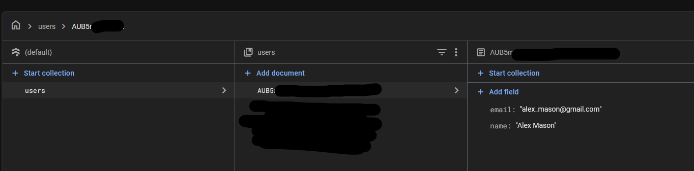
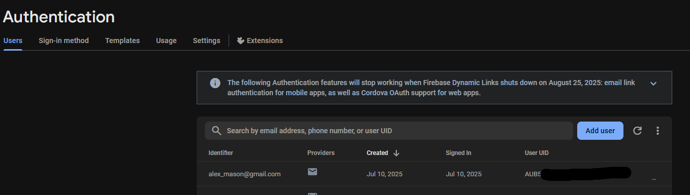
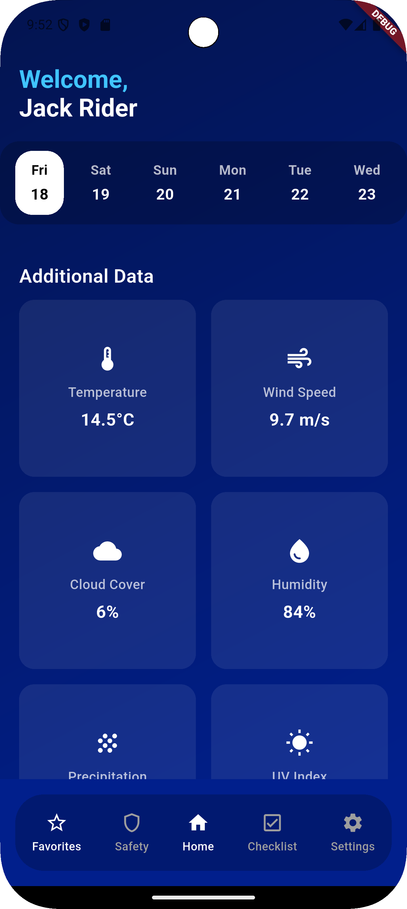

# Workout App

A new Flutter project for Tennis Players.

## Getting Started

This project is a starting point for a Flutter application.

1-Run these commands in the terminal

python3 -m venv venv

source venv/bin/activate //MAC

source venv/Scripts/activate. // Windows

pip install Flask

pip show Flask

pip install numpy

pip install scikit-learn==1.3.2

python app.py

python app.py // to host the AI model and access it through your local host on port 5001.

## Demo Video

[Click here to watch the demo video](assets/Demo_app_final.gif)

## Screenshots

